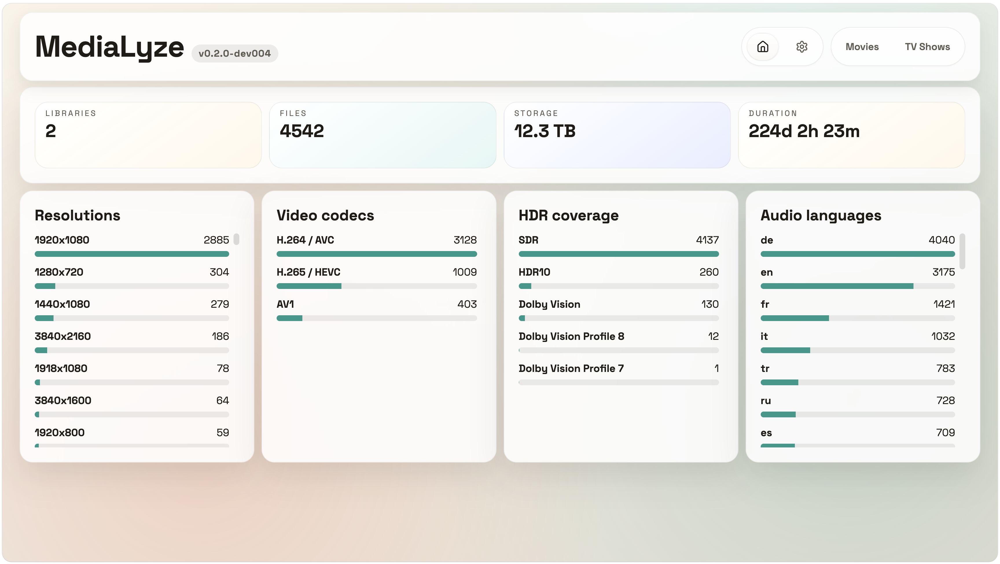
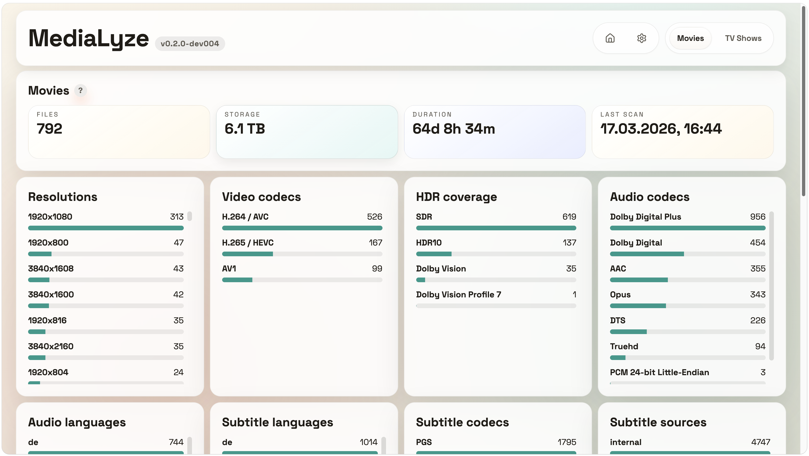
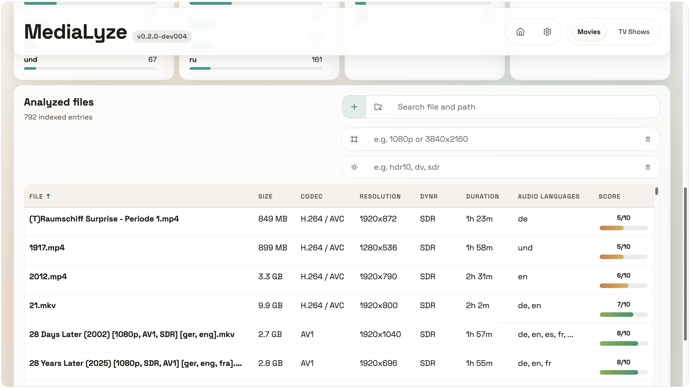
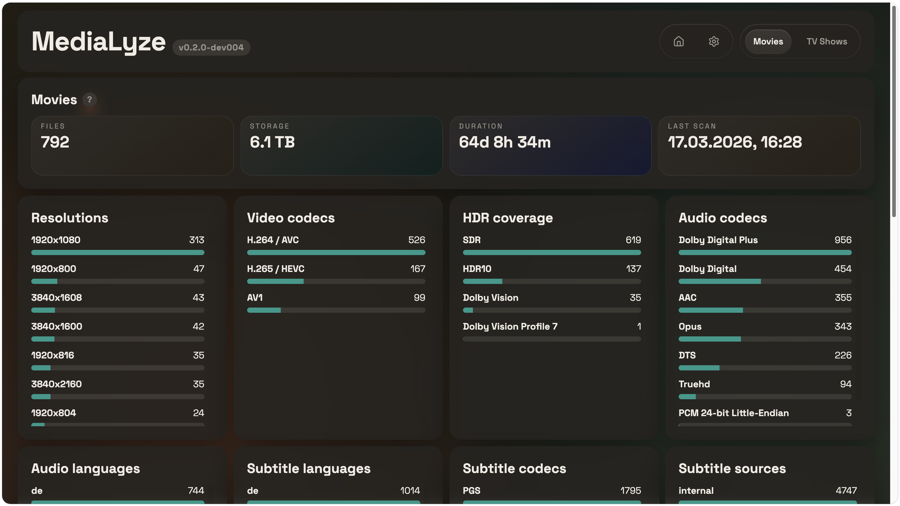
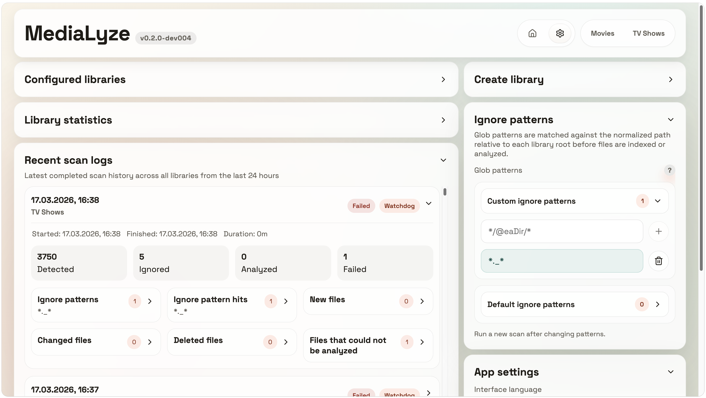

# MediaLyze

<p align="center">
  <a href="./LICENSE"></a>
  
  
  
  
  
</p>

<p align="center">
  Self-hosted media library analysis for large video collections.
  Scans your libraries and run analyses using <code>ffprobe</code>.
  Explore technical metadata through a FastAPI + React web UI.
</p>

<p align="center">
  MediaLyze focuses (for now) on just analysis, not playback, scraping, or file modification, READ ONLY on your files!
</p>



## Why MediaLyze

MediaLyze is built for self-hosted setups that need visibility into large media collections without depending on external services and designed around ffprobe with normalized metadata.

Everything with a simple deployment model: one container, one SQLite database, one UI.
Bring your own auth (for now).

## Features

- Technical media analysis powered by `ffprobe`
- Full and incremental scans using `path + size + mtime`
- Normalized formats, streams, subtitles, scan jobs, and quality scores (feel free to suggest improvements)
- Detection of internal and external subtitle files
- Ignore files and folders with simple glob patterns such as `*.nfo` or `*/Extras/*`
- SQLite with WAL mode and indexed filter fields
- FastAPI backend with a React + Vite frontend
- Docker-first deployment with a read-only media mount

## Screenshots

<table>
  <tr>
    <td></td>
    <td></td>
  </tr>
  <tr>
    <td></td>
    <td></td>
  </tr>
</table>

## Quick Start

### Run the published image

using docker-compose:
```bash
cd docker
cp .env.example .env
```
with production ready:
[docker-compose-prod.yaml](docker/docker-compose-prod.yaml)
___

using docker run:
```bash
mkdir -p ./config

docker run -d \
  --name medialyze \
  -p 8080:8080 \
  -e TZ=UTC \
  -v "$(pwd)/config:/config" \
  -v "/path/to/your/media:/media:ro" \
  ghcr.io/frederikemmer/medialyze:latest
```

Open `http://localhost:8080`.
The container serves plain HTTP on port `8080`; if you want HTTPS, terminate it in a reverse proxy.

### Build locally

```bash
cp docker/.env.example .env
docker compose up --build
```

The default container setup mounts:

- `./config` to `/config`
- `./media` to `/media` as read-only

If you want a different external port, set `HOST_PORT` in `.env`.

## Local Development

### Backend

```bash
python3 -m venv .venv
source .venv/bin/activate
pip install -e .[dev]
uvicorn backend.app.main:app --reload --port 8080
```

### Frontend

```bash
cd frontend
npm install
npm run dev
```

The Vite dev server proxies `/api` to `http://127.0.0.1:8080`.

## Configuration

Relevant environment variables:

- `CONFIG_PATH`: writable config/data directory, default `/config`
- `MEDIA_ROOT`: media mount root, default `/media`
- `HOST_PORT`: HTTP port exposed on the host, default `8080`; access the app via `http://<host>:<HOST_PORT>`
- `APP_PORT`: internal app port, default `8080`
- `TZ`: process/container timezone, default `UTC`
- `DISABLE_DEFAULT_IGNORE_PATTERNS`: optional; when set to `true`, built-in default ignore patterns are not preloaded
- `FFPROBE_PATH`: optional override for the `ffprobe` binary path
- `SCAN_RUNTIME_WORKER_COUNT`: maximum number of libraries scanned in parallel, default `4`
- `PUID` / `PGID`: optional runtime user/group ids for shared-folder permission setups; set both or leave both unset to keep the default root runtime user

`MEDIA_ROOT` should be mounted read-only in production.

If you need a specific runtime uid/gid, set `PUID` and `PGID` in `.env`. The compose files already load `.env`, so no compose changes are required.

For SMB / NAS setups, the recommended approach is to mount the share on the Docker host first and then point `MEDIA_HOST_DIR` at that host mount path.

Ignore rules use glob patterns matched against the normalized relative path inside each library. MediaLyze ships editable built-in defaults for common system and temporary paths such as `*/.DS_Store`, `*/@eaDir/*`, and `*.part`. Set `DISABLE_DEFAULT_IGNORE_PATTERNS=true` if you do not want those defaults preloaded on first start.
See [docs/ignore_files_folders.md](docs/ignore_files_folders.md) for a short guide.

## Tech Stack

- Backend: Python, FastAPI, SQLAlchemy, SQLite
- Frontend: React, Vite, TypeScript, i18next
- Media analysis: `ffprobe` / FFmpeg
- Scheduling and watch mode: APScheduler, watchdog
- Packaging: GHCR

## Project Status

MediaLyze is an open-source project under active development. The current focus is technical media analysis for large self-hosted libraries, with the v1 scope centered on scanning, normalization, statistics, and file inspection.

## Contributing & License

Contributions are welcome. Read [CONTRIBUTING.md](CONTRIBUTING.md) before opening a pull request.

This project is licensed under the [MIT License](LICENSE).
